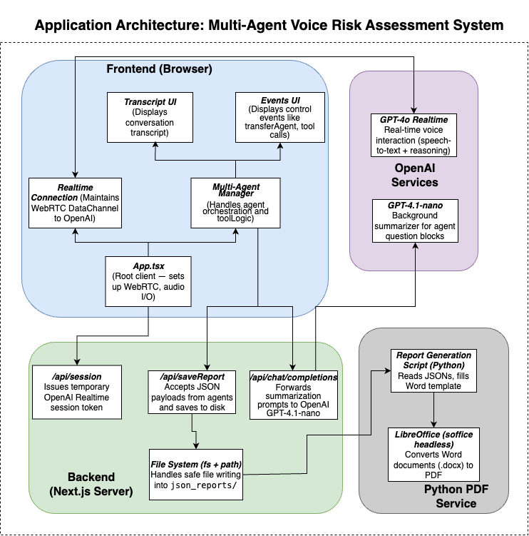

# Cybersecurity Risk Assessment with OpenAI Realtime API

## 1. Introduction

This project demonstrates a conversational cybersecurity risk assessment tool built using the OpenAI Realtime API. Engage in a natural conversation with an AI agent that guides you through various cybersecurity domains, asks relevant questions based on common frameworks, and helps identify potential areas of risk within your organization. The system leverages multiple specialized AI agents, each focusing on a specific domain like Access Control, Data Protection, or Incident Response.

## 2. Detailed Documentation

For a comprehensive overview of the system architecture, assessment process flow, individual agent details, setup instructions, and more, please refer to the auto-generated documentation available on DeepWiki:

[**View Detailed Documentation on DeepWiki**](https://deepwiki.com/sylvexxter/realtime-demo-risklink/)

## 3. Prerequisites

Before you begin, ensure you have the following installed on your system:

*   **Node.js:** Required to run the application runtime.
*   **npm (or yarn):** Node package manager, usually included with Node.js.
*   **OpenAI API Key:** Needed for the AI agents to function.
*   **LibreOffice:** Required for the PDF report generation feature.

### Installation Instructions:

**macOS:**

*   **Node.js & npm:**
    *   The easiest way is using Homebrew:
        ```bash
        brew install node
        ```
    *   Alternatively, download the installer from [nodejs.org](https://nodejs.org/).
*   **LibreOffice:**
    *   Using Homebrew:
        ```bash
        brew install --cask libreoffice
        ```
    *   Or download from the [LibreOffice website](https://www.libreoffice.org/download/download-libreoffice/).

**Windows:**

*   **Node.js & npm:**
    *   Download the installer from [nodejs.org](https://nodejs.org/). npm is included.
*   **LibreOffice (Optional):**
    *   Download the installer from the [LibreOffice website](https://www.libreoffice.org/download/download-libreoffice/).

## 4. Getting Started

Once the prerequisites are installed:

1.  **Clone the repository:**
    ```bash
    git clone <https://github.com/sylvexxter/realtime-demo-risklink.git> 
    cd <realtime-demo-risklink>
    ```
2.  **Install Node.js dependencies:**
    ```bash
    npm install
    ```
    *(If you prefer yarn: `yarn install`)*
3.  **Install Python dependencies (for PDF generation):**
    ```bash
    pip install -r requirements.txt
    ```
4.  **Configure Environment Variables:**
    *   Create a file named `.env` in the root directory of the project.
    *   Add your OpenAI API Key to this file:
        ```
        OPENAI_API_KEY=your_api_key_here
        ```
5.  **Run the application:**
    ```bash
    npm run dev
    ```
6.  Open your browser to [http://localhost:3000](http://localhost:3000). The application should load and be ready for interaction.

## 5. Architecture



The application follows a multi-agent architecture designed for real-time voice-based risk assessment:

*   **Frontend (Browser):** Built with React (`App.tsx`), it manages the user interface (`Transcript UI`, `Events UI`), handles audio input/output, and maintains a real-time WebRTC connection to OpenAI services via the `Realtime Connection` component. A `Multi-Agent Manager` orchestrates the conversation flow and tool logic within the browser.
*   **Backend (Next.js Server):** Provides APIs for session management (`/api/session` for OpenAI Realtime tokens), saving assessment data (`/api/saveReport` writing JSON to the file system), and interacting with background AI models for summarization (`/api/chat/completions` using GPT-4.1-nano).
*   **OpenAI Services:** Leverages `GPT-4o Realtime` for core speech-to-text and reasoning during the live interaction. `GPT-4.1-nano` is used asynchronously via the backend for summarizing conversation blocks.
*   **Python PDF Service:** An independent service that takes the saved JSON assessment data, populates a Word template using a Python script, and converts it to a PDF report using a headless LibreOffice (`soffice`) instance.

## 6. PDF Report Generation

This application includes a feature to generate a consolidated PDF report summarizing the risk assessment findings up to a certain point.

## 7. Core Contributors

This project was developed as part of a capstone project for the Master of Science in Information Security Policy and Management (MSISPM) program at Carnegie Mellon University. It was built on previous work done by OpenAI.

*   **OpenAI Contacts:**
    *   Noah MacCallum - [noahmacca](https://x.com/noahmacca)
    *   Ilan Bigio - [ibigio](https://github.com/ibigio)
*   **CMU Capstone Team:**
    *   Sneh Sadaria - [sylvexxter]
    *   Khushi Shah - [khushi2609]
    *   Wendy Hu
    *   Yan Tian
    *   Tra-Vaughn James 
